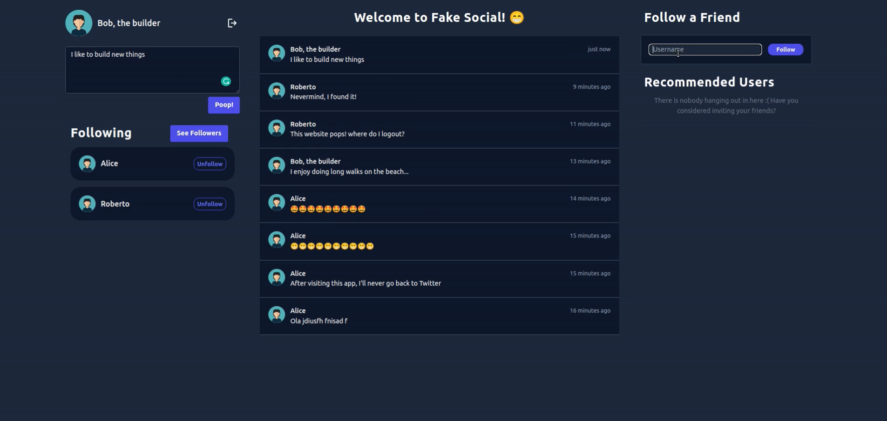

# Fake Social - Decentralized Social Media

Fake Social is a **peer to peer timeline service**, similar to the centralized versions: *Twitter, Facebook, etc*.

See the App in action in our [demo](https://www.youtube.com/watch?v=1KapA_3w4RM)!

There's also a presentation with more implementation details [here](./doc/report.pdf).

## Setup
There are 3 services in our system: *Bootstrap Nodes*, *node backend*, and *node frontend*, located in the designated files inside `src`.

To run each one, simply run the following commands inside each repository:

```bash
npm install

npm start
```

To work properly, the system should contain bootstrap nodes running before initializing the normal nodes. Each `node` is composed of a backend and a frontend service, that should be properly connected through the `.env` or `package.json` files directly. 


##  Structure
### Backend (`src/backend`)

Peers of the application, accompanied by a REST API so it can communicate with the frontend.

### Frontend (`src/frontend`)

Interface of the application, where the user can interact with a node.

### Bootstrap (`src/bootstrap`)

Nodes that are responsible for the initial connection of the network and for helping nodes discovering new peers.

## Screenshot




## Group members:

1. Bruno Rosendo (up201906334@fe.up.pt)
2. Henrique Nunes (up201906852@fe.up.pt)
3. João Mesquita (up201906682@fe.up.pt)
4. Rui Alves (up201905853@fe.up.pt)
